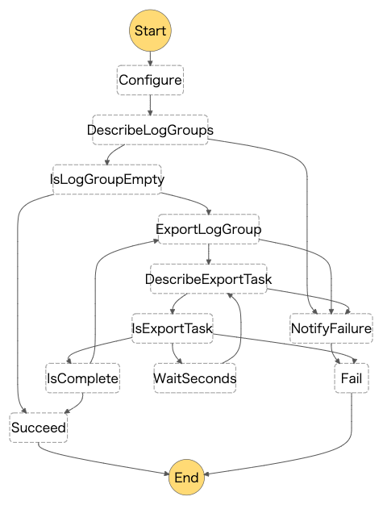

# cloudwatchlog2s3

Cloudwatch Logsを定期的にS3へ保存する。
(Step Functions + Lambdaを使用しています)

## structure
### ディレクトリ構造
```
├── README.md
├── docs # ドキュメント格納用
│   └── stepfunctions_graph.png # 処理フロー図
├── event-samples # 個別にfunctionsを実行する時の為のイベントサンプル
│   └── export-log-group-event.json
├── functions # lambda群
│   ├── describe-export-task # エクスポートタスクを確認しステータスを返却する。
│   │   ├── app.js
│   │   └── package.json
│   ├── describe-log-groups # エクスポート対象のロググループを取得する。取得したロググループ名のリストとリストの数をステートマシンに返却する。
│   │   ├── app.js
│   │   └── package.json
│   ├── export-log-group # エクスポート(アーカイブ)を実行する。1回の実行でエクスポートを行うのは、1つのロググループのみ。ロググループが複数ある場合は、後続のステートからこのステートに処理が戻る。
│   │   ├── app.js
│   │   ├── package-lock.json
│   │   └── package.json
│   └── notify-failure # アーカイブに失敗した場合にSlackで通知する。
│       ├── app.js
│       ├── package-lock.json
│       └── package.json
├── samconfig.toml # SAM コマンドパラメータ設定ファイル
├── statemachine # ステートマシン関連ファイル格納用
│   └── cloudwatchlog2s3.asl.json # ステートマシン定義ファイル
│   └── cloudwatchlog2s3_local.asl.json # ステートマシン定義ファイル（ローカルで動かすときに使う
└── template.yaml # SAM テンプレートファイル
```
### 処理フロー

## Installation
### Docker Desktop for Mac
https://docs.docker.jp/docker-for-mac/install.html
### AWS SAM CLI
https://docs.aws.amazon.com/ja_jp/serverless-application-model/latest/developerguide/serverless-sam-cli-install-mac.html
### AWS Step Functions
```bash
$ docker pull amazon/aws-stepfunctions-local
```
## Run
### AWS SAM CLI
```bash
$ sam build
$ sam local start-lambda --region ap-northeast-1
```
### AWS Step Functions
```bash
$ docker run -p 8083:8083 --env-file aws-stepfunctions-local-credentials.txt amazon/aws-stepfunctions-local
```
## Usage
```bash
# ローカルでテストしたい場合、テスト用のs3バケットを別途作成しそちらにエクスポートするようにして下さい。template.yaml の ARCHIVE_S3_BUCKET_NAME を変更すればそちらに出力されます。変更後はsam buildとsamの再起動が必要です。

# ステートマシンをローカル上に作成
$ aws stepfunctions --endpoint http://localhost:8083 create-state-machine --name "Cloudwatchlog2s3StateMachine" --role-arn "arn:aws:iam::123456789012:role/DummyRole" --definition file://./statemachine/cloudwatchlog2s3_local.asl.json

# ステートマシンを実行
$ aws stepfunctions --endpoint http://localhost:8083 start-execution --state-machine arn:aws:states:ap-northeast-1:123456789012:stateMachine:Cloudwatchlog2s3StateMachine --name test

# 実行状態確認
$ aws stepfunctions --endpoint http://localhost:8083 describe-execution --execution-arn arn:aws:states:ap-northeast-1:123456789012:execution:Cloudwatchlog2s3StateMachine:test

# 削除
$ aws stepfunctions --endpoint http://localhost:8083 delete-state-machine --state-machine-arn arn:aws:states:ap-northeast-1:123456789012:stateMachine:Cloudwatchlog2s3StateMachine
```

## Deploy the sample application
```bash
sam build

# デプロイ
sam deploy --guided
```
## Deletes an AWS SAM application
```bash
sam delete --stack-name Cloudwatchlog2s3StateMachine
```
